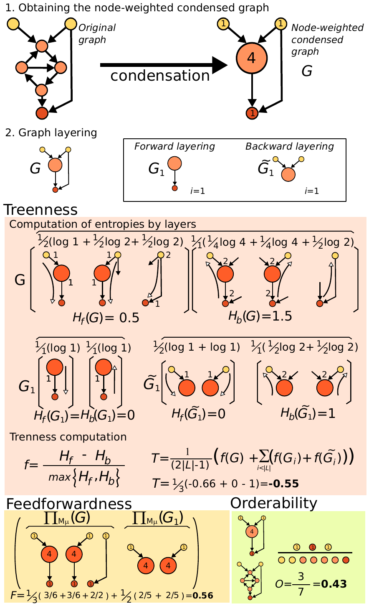

### Hierarchy Coordinates

A package for calculation of hierarchy coordinates of networks, as originally formulated exclusively for unweighted directed
networks<sup id="a1">[1](#f1)</sup> by [Corominas-Murta et al. (2013)][0.1] in _On the Origins of Hierarchy in Complex Networks_,
and subsequently implemented in Matlab v7, this package provides a python3 implementation which includes weighted networks. 

Hierarchy coordinates describe a network in terms of its treeness, orderability, and feedforwardness (TFO coordinates),
which collectively describe the relevant aspects of hierarchy for many networks. Below is an illustration by [Corominas-Murta et al. (2013)][0.1] 
of the hierarchy morphospace with example networks illustrated for accessible coordinates. 


There are a variety of functions required for the calculation of hierarchy coordinates, including initially reducing a simple,
directed graph into a node weighted Directed Acyclic Graph (DAG), and thereafter making use of:
_max_min_layers_, *(recursive)_leaf_removal*, *graph_entropy*, and the base hierarchy coordinate functions<sup id="a2">[2](#f2)</sup>.
Naturally all may be used independently, or for the common purpose of simply finding the hierarchy coordinates of a given graph
(including a binary graph, for which the thresholds are not used) one may simply use _hierarchy_coordinates.average_hierarchy_coordinates_,
as in this example code:
```
import numpy as np
import hierarchy_coordinates as hc

Adjacency_Matrix = np.random.rand(10, 10)
orderability, feedforwardness, treeness = hc.average_hierarchy_coordinates(Adjacency_Matrix)
```

Another graphic by [Corominas-Murta et al. (2013)][0.1] provides a rough notion of the corresponding calculation:


Calculation of hierarchy coordinates for weighted networks are performed simply by reducing weighted networks to a set of 
unweighted networks based on either exponentially or linearly distributed thresholds, and subsequently averaging their 
hierarchy coordinates as given by the original algorithm described in their [appendix][0.3].
![An illustration of linear vs exponential threshold distributions (right) and the corresponding unweighted networks
created from them (left). For details regarding the adaptation from unweighted to weighted networks, see the
[associated thesis][0.5]](readme_docs/Threshold_Explainations.png)

<!---- References: ---->
[0.1]: https://arxiv.org/abs/1303.2503
[0.2]: HierarchyCoordinates.py
[0.3]: https://www.pnas.org/content/suppl/2013/07/25/1300832110.DCSupplemental
[0.5]: readme_docs/Emergence%20of%20Hierarchy%20via%20Local%20Adaptation%20to%20Diffusion.pdf

<!---- Footnotes: ---->
<b id="f1">1</b> Supplementary material of [Corominas-Murta et al. (2013)][0.1] with detailed description of the hierarchy 
coordinates may be found [here][0.3]

<b id="f2">2</b> Feedforwardness and treeness are calculated through recursive application of the same 'base' version of 
their respective functions _feedforwardnes_iteration_ and  _single_graph_treeness_. [↩](#a2)

